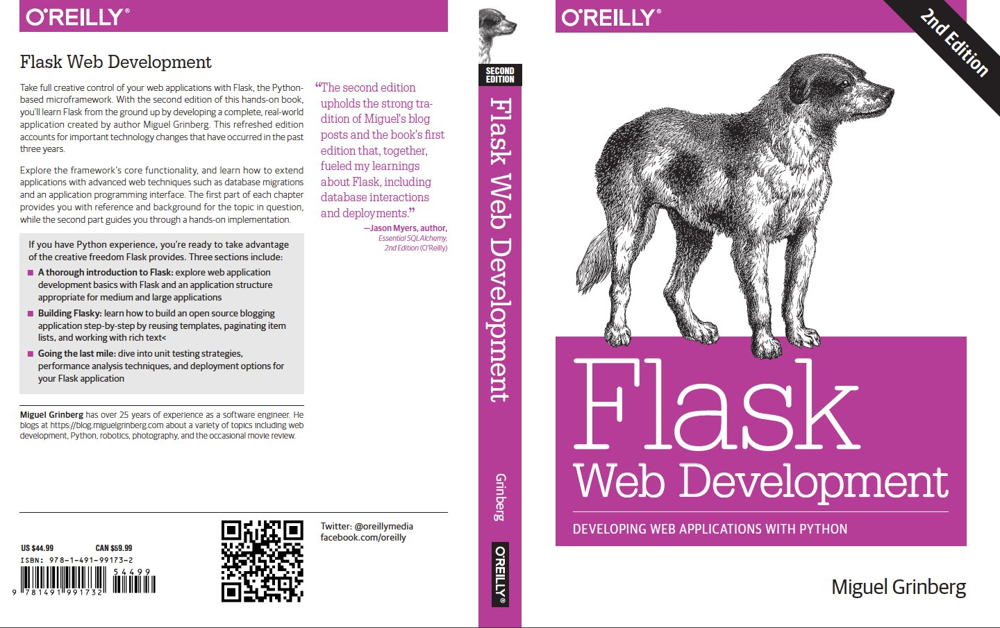

# Flask Web Development

Follows the book "Flask Web Development" by Miguel Grinberg

* Project starts on Chapter 2 *



## Useful Commands

**Show url map:**

```shell
>>> from app import app
>>> app.url_map
Map([<Rule '/' (HEAD, OPTIONS, GET) -> index>,
 <Rule '/static/<filename>' (HEAD, OPTIONS, GET) -> static>,
 <Rule '/user/<name>' (HEAD, OPTIONS, GET) -> user>])
```

## Useful Knowledge

### Context Globals

| Variable Name | Context | Description |
| ------------- | ------- | ----------- |
| current_app | Application Context | The application instance for the active application. |
| g | Application Context | An object that the application can use for temporary storage during the handling of a request. This variable is reset with each request. |
| request | Request Context | The request object, which encapsulates the contents of a HTTP request sent by the client. |
| session | Request Context | The user session, a dictionary that the application can use to store values that are "remembered" between requests. |

Four basic Request Hooks:

| Hook | Description |
| ------------- | ------- |
| before_first_request | Register a function to run before the first request is handled.|
| before_request | Register a function to run before each request. |
| after_request | Register a function to run after each request, if no unhandled exceptions occurred.|
| teardown_request | Register a function to run after each request, even in unhandled exception occurs. |

### Special Responses

Creating a Response Object:

```python
from flask import make_response

@app.route('/')
def index():
  response = make_response('<h1>This document carries a cookie!</h1>')
  response.set_cookie('answer', '42')
  return response
```

*reating a Redirect:

```python
from flask import redirect

@app.route('/')
def index():
  return redirect('http://www.example.com')
```

Creating an Abort function:

```python
from flask import abort

@app.route('/user/<id>')
def get_user(id):
  user = load_user(id)
  if not user:
    abort(404)
  return f'<h1>Hello, {user.name}</h1>
```

### Command Line Options with Flask-Script

first install

```shell
> pipenv install flask-script
```

Update the application script

```python
from flask.ext.script import Manager

manager = Manager(app)

# ...

if __name__ == '__main__':
  manager.run()
```

Now you can view the command line utility usage message

```shell
> python app.py
usage: app.py [-?] {shell,runserver} ...

positional arguments:
  {shell,runserver}
    shell            Runs a Python shell inside Flask application context.
    runserver        Runs the Flask development server i.e. app.run()

optional arguments:
  -?, --help         show this help message and exit

> python app.py runserver --help
usage: app.py runserver [-?] [-h HOST] [-p PORT] [--threaded] 
[--processes PROCESSES] [--passthrough-errors] [-d] [-D] [-r] 
[-R] [--ssl-crt SSL_CRT] [--ssl-key SSL_KEY]

Runs the Flask development server i.e. app.run()

optional arguments:
  -?, --help            show this help message and exit
  -h HOST, --host HOST
  -p PORT, --port PORT
  --threaded
  --processes PROCESSES
  --passthrough-errors
  -d, --debug           enable the Werkzeug debugger 
                        (DO NOT use in production code)
  -D, --no-debug        disable the Werkzeug debugger
  -r, --reload          monitor Python files for changes 
                        (not 100% safe for production use)
  -R, --no-reload       do not monitor Python files for changes
  --ssl-crt SSL_CRT     Path to ssl certificate
  --ssl-key SSL_KEY     Path to ssl key

> python app.py runserver
 * Serving Flask app "app" (lazy loading)
 * Environment: production
   WARNING: This is a development server. Do not use it in a 
            production deployment.
   Use a production WSGI server instead.
 * Debug mode: off
 * Running on http://127.0.0.1:5000/ (Press CTRL+C to quit)
127.0.0.1 - - [28/Dec/2020 17:31:55] "GET / HTTP/1.1" 200 -

# Changing the host server
> python app.py runserver --host 0.0.0.0
 * Serving Flask app "app" (lazy loading)
 * Environment: production
   WARNING: This is a development server. Do not use it in 
            a production deployment.
   Use a production WSGI server instead.
 * Debug mode: off
 * Running on http://0.0.0.0:5000/ (Press CTRL+C to quit)
```

### Rendering Templates

```python
from flask import Flask, render_template

# ...

@app.route('/index')
def index():
  return render_template('index.html')

@app.route('/user/<name>')
def user(name):
  return render_template('user.html', name=name)
```

### Jinja2 Variable filters
| Filter Name | Description |
| ----------- | ----------- |
| safe | Renders the value without applying escaping|
| capitalize | Converts the first character of the value to uppercase and the rest to lowercase|
| lower | Converts the value to lowercase characters |
| upper | Converts the value to uppercase characters |
| title | Capitalizes each word in the value |
| trim | Removes the leading and trailing whitespaces from the value |
| striptags | Removes any HTML tags from the value before rendering |